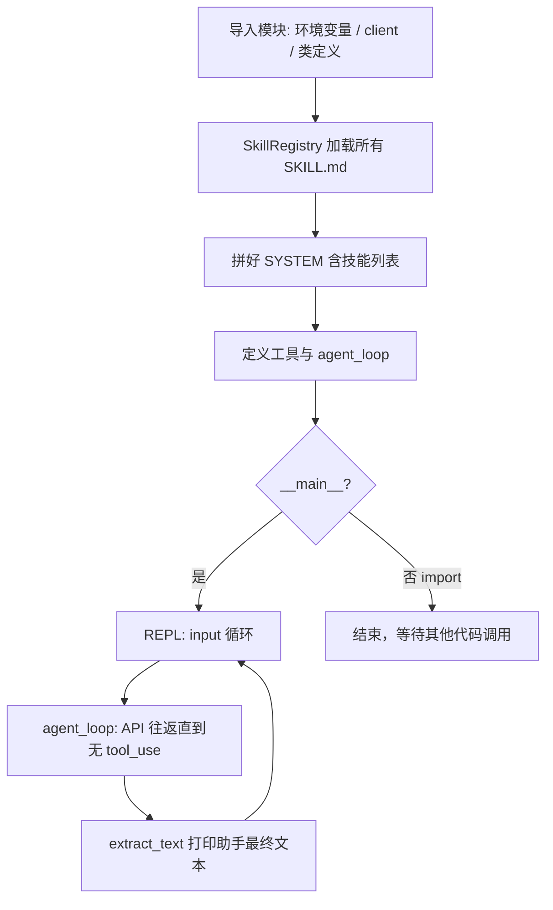

# s05 skill loading — 本次 Chat 完整记录

> 说明：以下为会话全文按时间顺序整理，未做摘要或删减。

---

## 用户 1

@agents/s03_todo_write.py:95 和 @agents/s05_skill_loading.py:51 这两种写法有什么区别，两种写法应该在什么条件下使用

**附：代码引用**

- `agents/s03_todo_write.py` 第 95 行：`items: list[PlanItem] = field(default_factory=list)`
- `agents/s05_skill_loading.py` 第 51 行：`self.documents: dict[str, SkillDocument] = {}`

---

## 助手 1

下面用你仓库里的两处代码说明区别和选用方式。

## 1. `field(default_factory=list)`（dataclass）

```93:96:D:\个人文件\python\claude_learn\learn-claude-code\agents\s03_todo_write.py
@dataclass
class PlanningState: #计划状态类，用于存储计划条目列表和回合数。
    items: list[PlanItem] = field(default_factory=list)
    rounds_since_update: int = 0
```

这是 **在 `@dataclass` 里给「可变默认值」用的标准写法**。  
`dataclass` 会按字段生成 `__init__`；若写成 `items: list[PlanItem] = []`，那个 `[]` 在 **类定义时只算一次**，所有实例会 **共用同一个 list**，是典型的坑。  
`default_factory=list` 表示：**每新建一个实例就调用一次 `list()`**，每人一份空列表。

**适用条件：** 使用 `dataclass`（或类似需要「按实例」生成默认值的机制），且默认值是 list、dict、set 等可变对象时，用 `default_factory`，不要直接 `= []` / `= {}`。

---

## 2. `self.documents = {}`（普通类 `__init__`）

```48:52:D:\个人文件\python\claude_learn\learn-claude-code\agents\s05_skill_loading.py
class SkillRegistry:    #创建类对象：skill注册表
    def __init__(self, skills_dir: Path):
        self.skills_dir = skills_dir
        self.documents: dict[str, SkillDocument] = {}
        self._load_all()
```

这是在 **实例构造函数里** 给实例绑属性。`{}` 在 **每次 `SkillRegistry(...)` 时都会执行一次**，所以每个注册表实例都有自己的 `documents`，**不会**像「类属性里写 `{}`」那样被所有实例共享。

**适用条件：** 手写普通类、在 `__init__`（或其它每次创建实例都会跑的方法）里初始化实例状态时，直接 `self.xxx = {}` / `self.xxx = []` 是正常且常见的写法。

---

## 对照小结

| 写法 | 出现在哪里 | 含义 |
|------|------------|------|
| `field(default_factory=list)` | `@dataclass` 字段 | 由 dataclass 机制保证「每个实例一份新 list」 |
| `self.documents = {}` | `__init__` 里 | 每次构造实例执行一次，天然「每个实例一份新 dict」 |

**要避免的：** 在 **类体里**（不在 `__init__`）写可变默认值，例如 `documents: dict = {}` 作为类属性——那样多个实例会共享同一个字典。

你这两处都是合理用法：`PlanningState` 用 dataclass 的 `default_factory`；`SkillRegistry` 在 `__init__` 里给 `self.documents` 赋新字典。若把 `SkillRegistry` 也改成 dataclass，字典字段同样应写成 `field(default_factory=dict)`，而不是在字段上写 `= {}`。

---

## 用户 2

@agents/s05_skill_loading.py:58 请问这句代码中使用的是哪些函数方法，请讲解这些函数方法如何使用

**附：代码引用**

- `agents/s05_skill_loading.py` 第 58 行：`for path in sorted(self.skills_dir.rglob("SKILL.md")):`

---

## 助手 2

这行代码里实际用到的是 **`Path.rglob`** 和内置函数 **`sorted`**（`self.skills_dir` 是 `pathlib.Path`，在 `__init__` 里赋值的目录路径）。

```58:58:D:\个人文件\python\claude_learn\learn-claude-code\agents\s05_skill_loading.py
        for path in sorted(self.skills_dir.rglob("SKILL.md")):
```

---

### 1. `self.skills_dir`（`pathlib.Path`）

表示技能根目录，例如 `WORKDIR / "skills"`。后面的 `.rglob(...)` 都是 **在这个目录树下** 递归查找。

---

### 2. `Path.rglob(pattern)`

- **含义**：在当前路径代表的目录下 **递归** 匹配文件名/路径模式，返回一个 **迭代器**，元素是 **`Path` 对象**。
- **和 `glob` 的区别**：`glob` 一般只匹配当前这一层；`rglob` 会进入所有子目录。
- **本例**：`"SKILL.md"` 是字面文件名，会在任意深度的子目录里找到所有叫 `SKILL.md` 的文件。

简单例子：

```python
from pathlib import Path
root = Path("skills")
for p in root.rglob("SKILL.md"):
    print(p)  # 例如 skills/a/SKILL.md, skills/b/c/SKILL.md
```

模式里也可以用通配符，例如 `*.md`（具体规则与 `fnmatch` 类似）。

---

### 3. `sorted(iterable, ...)`

- **含义**：把可迭代对象里的元素 **排序**，返回 **新的列表**（默认按元素自身可比较规则；对 `Path` 来说通常是按字符串路径排序）。
- **本例**：`rglob` 返回的顺序可能因文件系统而异，包一层 `sorted` 后，遍历顺序 **稳定、可预期**（便于测试和日志一致）。

常用形式：

```python
sorted(iterable)                    # 升序
sorted(iterable, reverse=True)      # 降序
sorted(iterable, key=lambda x: x.name)  # 按自定义键排序
```

---

### 整行在做什么

在 `skills_dir` 下 **递归找出所有 `SKILL.md`**，按路径 **排好序**，再逐个赋给 `path` 做后续解析。没有额外“神秘”方法，就是 **`rglob` + `sorted` + `for`**。

---

## 用户 3

@agents/s05_skill_loading.py:59 请问这句代码中使用的是哪些函数方法，请讲解这些函数方法如何使用，并列举简单例子演示

**附：代码引用**

- `agents/s05_skill_loading.py` 第 59 行：`meta, body = self._parse_frontmatter(path.read_text())`

---

## 助手 3

这行代码做了三件事：**读文件文本**、**解析 frontmatter**、**把返回的两个值拆成两个变量**。

```59:59:D:\个人文件\python\claude_learn\learn-claude-code\agents\s05_skill_loading.py
            meta, body = self._parse_frontmatter(path.read_text())
```

---

## 1. `path.read_text()`（`pathlib.Path`）

- **作用**：把整个文件读成 **字符串**（默认 UTF-8，也可用 `encoding=` 指定）。
- **常见参数**：`encoding`、`errors`；需要二进制时用 `read_bytes()`。

```python
from pathlib import Path
p = Path("SKILL.md")
text = p.read_text(encoding="utf-8")
```

---

## 2. `self._parse_frontmatter(text)`（本类自定义方法）

- **作用**：把整段字符串拆成 **元数据字典 `meta`** 和 **正文 `body`**（YAML 式 frontmatter：`---` … `---` 后面是正文）。
- **返回**：`tuple[dict, str]`；若没有匹配到 frontmatter，返回 `({}, 全文)`。

对应实现：

```65:76:D:\个人文件\python\claude_learn\learn-claude-code\agents\s05_skill_loading.py
    def _parse_frontmatter(self, text: str) -> tuple[dict, str]:    #这个方法应该是做skill文档结构化输出的
        match = re.match(r"^---\n(.*?)\n---\n(.*)", text, re.DOTALL) #正则解析text
        if not match:
            return {}, text

        meta = {}
        for line in match.group(1).strip().splitlines():
            if ":" not in line:
                continue
            key, value = line.split(":", 1)
            meta[key.strip()] = value.strip()
        return meta, match.group(2) #返回skill描述和skill正文
```

---

## 3. `meta, body = ...`（元组拆包）

- **作用**：右边返回 `(dict, str)`，左边两个名字一一对应接住，相当于：

```python
result = self._parse_frontmatter(path.read_text())
meta = result[0]
body = result[1]
```

---

## 合在一起的小例子

假设 `SKILL.md` 内容为：

```text
---
name: my-skill
description: 演示用
---

这里是正文部分。
```

执行流程示意：

```python
text = path.read_text()
# text 就是上面整段字符串

meta, body = self._parse_frontmatter(text)
# meta ≈ {"name": "my-skill", "description": "演示用"}
# body ≈ "这里是正文部分。\n"
```

若文件 **没有** `---` 开头的 frontmatter，`_parse_frontmatter` 会返回 `({}, 整个文件内容)`，后面代码用 `meta.get("name", path.parent.name)` 从目录名兜底。

---

**小结**：`read_text()` 负责 **读盘**；`_parse_frontmatter()` 负责 **拆 YAML 头 + 正文**；`meta, body =` 是 Python 的 **元组解包**，把一对返回值赋给两个变量。

---

## 用户 4

@agents/s05_skill_loading.py:60 请分析这句代码，并说明代码中使用了什么函数方法

**附：代码引用**

- `agents/s05_skill_loading.py` 第 60 行：`name = meta.get("name", path.parent.name)`

---

## 助手 4

这行代码在给技能起一个 **最终使用的名字**：优先用 frontmatter 里的 `name`，没有再用 **所在文件夹的名字**。

```60:60:D:\个人文件\python\claude_learn\learn-claude-code\agents\s05_skill_loading.py
            name = meta.get("name", path.parent.name)
```

---

## 用到的对象与方法

| 部分 | 类型 / 含义 |
|------|-------------|
| `meta` | 字典（`_parse_frontmatter` 解析出的 YAML 头） |
| `meta.get("name", path.parent.name)` | 字典的 **`get`** 方法 |
| `path` | `pathlib.Path`，当前这个 `SKILL.md` 的路径 |
| `path.parent` | `Path` 的 **属性**：当前文件的 **父目录**（也是一个 `Path`） |
| `path.parent.name` | 父目录路径的 **最后一段名字**（字符串），例如 `.../foo/SKILL.md` → `"foo"` |

---

## `dict.get(key, default)`

- **作用**：取键 `key` 的值；**若键不存在**，返回 `default`，**不会**像 `meta["name"]` 那样抛 `KeyError`。
- **本行**：有 `"name"` 且值非 `None` 时用 meta 里的名字；否则用 `path.parent.name`。

注意：若 YAML 里写了 `name:` 但值为空字符串，`get` 仍会认为键存在，可能得到 `""` 而不是目录名——这是 `get` 的常规行为，与「键缺失」不同。

---

## `path.parent` 与 `.name`

- `path` 例如：`D:\project\skills\my-tool\SKILL.md`
- `path.parent` → `...\skills\my-tool`
- `path.parent.name` → `"my-tool"`

这样即使没在 frontmatter 里写 `name`，也能用 **技能目录名** 作为注册名，与 `SKILLS_DIR` 下按文件夹组织技能的方式一致。

---

**一句话**：用 **`dict.get` 做带默认值的查找**，用 **`Path.parent.name` 提供「所在文件夹名」作为默认技能名**。

---

## 用户 5

@agents/s05_skill_loading.py:85 join函数返回的结果是字符串吗，请你列举一个具体的例子演示

**附：代码引用**

- `agents/s05_skill_loading.py` 第 85 行：`return "\n".join(lines)`

---

## 助手 5

是的。**`str.join(可迭代对象)` 的返回值类型是 `str`（字符串）**。

这里用的是 **`"\n".join(lines)`**：用换行符 `"\n"` 把 `lines` 里每一段 **字符串** 拼成 **一整段字符串**。

---

### 具体例子

```python
lines = ["第一行", "第二行", "第三行"]
result = "\n".join(lines)
# result 是 str：
# '第一行\n第二行\n第三行'

print(result)
# 输出（显示为三行）:
# 第一行
# 第二行
# 第三行

print(type(result))  # <class 'str'>
```

再举一个和「列表里是空」相关的例子：

```python
lines = []
result = "\n".join(lines)
# result == ''  （空字符串）
```

---

### 小提示

- **`join` 是字符串的方法**，写法是 **`分隔符.join(列表)`**，不是 `join(分隔符, 列表)`。
- `lines` 里的元素必须是 **字符串**（或能转成字符串的类型在部分场景需注意）；若混入了 `int`，需要先 `str(x)`。

所以在你选中的 `return "\n".join(lines)` 里，**函数返回的就是把多行说明拼好后的一个字符串**。

---

## 用户 6

请说明sorted()的使用方法，并举例演示

---

## 助手 6

## `sorted()` 是什么

`sorted()` 是 Python **内置函数**，对 **可迭代对象**（列表、元组、字符串、字典的键/值等）做排序，**返回一个新的列表**，**不会**原地修改原来的可迭代对象（和 `list.sort()` 不同）。

---

## 基本用法

```python
sorted(iterable)
```

- 元素需能互相比较（或可配合 `key` 比较），否则会报错。

```python
sorted([3, 1, 4, 1, 5])           # [1, 1, 3, 4, 5]
sorted("cba")                     # ['a', 'b', 'c']  字符按 Unicode 排序
sorted(("z", "a", "m"))           # ['a', 'm', 'z']
```

---

## 常用参数

### `reverse=True` 降序

```python
sorted([3, 1, 4], reverse=True)   # [4, 3, 1]
```

### `key=函数` 按「键」排序

对每个元素先算 `key(元素)`，再按这个键排序。

```python
words = ["banana", "pie", "Washington"]
sorted(words, key=len)            # 按长度：['pie', 'banana', 'Washington']

pairs = [(2, "b"), (1, "a"), (3, "c")]
sorted(pairs, key=lambda x: x[0]) # [(1, 'a'), (2, 'b'), (3, 'c')]
```

不区分大小写排字符串：

```python
sorted(["Dog", "apple", "Cat"], key=str.lower)
# ['apple', 'Cat', 'Dog']
```

---

## 和 `list.sort()` 的对比

| | `sorted(x)` | `lst.sort()` |
|---|-------------|--------------|
| 返回值 | **新列表** | `None`（原地改 `lst`） |
| 能否用于任意可迭代对象 | 能 | 只能用于 **列表** |

```python
a = [3, 1, 2]
b = sorted(a)      # a 仍是 [3, 1, 2]，b 是 [1, 2, 3]

a.sort()           # a 变成 [1, 2, 3]，返回 None
```

---

## 你项目里的用法（回忆）

```python
for path in sorted(self.skills_dir.rglob("SKILL.md")):
```

对 `rglob` 得到的 `Path` 做排序，遍历顺序稳定、可预期（一般按路径字符串排序）。若只想按 **文件名** 排，可以写：

```python
sorted(paths, key=lambda p: p.name)
```

以上就是 `sorted()` 的常见用法和示例。

---

## 用户 7

请举例分别列举sorted()对列表、字典、集合、元组的返回结果

---

## 助手 7

下面用「直接可运行」的例子说明：`sorted()` **一律返回新的 `list`**，不会把结果变回元组或集合。

---

### 1. 列表 `list`

```python
sorted([3, 1, 2])
# 返回: [1, 2, 3]   （类型：list）
```

---

### 2. 字典 `dict`

对字典迭代时，默认迭代的是 **键**；`sorted(d)` 等价于 **对键排序**。

```python
d = {"b": 2, "a": 1, "c": 3}

sorted(d)
# 返回: ['a', 'b', 'c']   （按键排序后的键列表）

sorted(d.items(), key=lambda kv: kv[0])
# 返回: [('a', 1), ('b', 2), ('c', 3)]   （按键排序的 (键, 值) 列表）

sorted(d.items(), key=lambda kv: kv[1])
# 返回: [('a', 1), ('b', 2), ('c', 3)]   （按值排序）
```

---

### 3. 集合 `set`

集合无序；`sorted` 会得到 **排好序的列表**。

```python
sorted({3, 1, 2, 2})
# 返回: [1, 2, 3]   （去重 + 排序，类型仍是 list）
```

---

### 4. 元组 `tuple`

```python
sorted((3, 1, 2))
# 返回: [1, 2, 3]   （注意：结果是 list，不是 tuple）

# 若需要再变回元组：
tuple(sorted((3, 1, 2)))
# 返回: (1, 2, 3)
```

---

### 小结

| 输入类型 | `sorted(...)` 的典型含义 | 返回值类型 |
|----------|---------------------------|------------|
| 列表 | 元素排序 | **`list`** |
| 字典 | 默认对 **键** 排序 | **`list`**（键或 `(键,值)` 元组的列表） |
| 集合 | 元素排序 | **`list`** |
| 元组 | 元素排序 | **`list`**（不是 `tuple`） |

共同点：**返回值都是 `list`**。

---

## 用户 8

请分析agents\s05_skill_loading.py回答以下问题：
1、请向我解释本文件代码的运行顺序

---

## 助手 8

下面按 **Python 实际执行顺序** 说明 `agents/s05_skill_loading.py` 在「被导入」和「直接运行」时分别发生什么。

---

## 一、文件被加载时（`import` 或 `python s05_skill_loading.py` 都会执行）

从上到下依次执行：

1. **导入与环境**（约 15–32 行）  
   导入标准库与第三方库 → `load_dotenv()` → 若设置了 `ANTHROPIC_BASE_URL` 则删除 `ANTHROPIC_AUTH_TOKEN` → 定义 `WORKDIR`、`client`、`MODEL`、`SKILLS_DIR`。

2. **类定义**（35–97 行）  
   定义 `SkillManifest`、`SkillDocument`、`SkillRegistry`（此时**只注册类**，不自动创建注册表实例）。

3. **全局注册表初始化**（100 行）——**关键一步**  
   `SKILL_REGISTRY = SkillRegistry(SKILLS_DIR)` 会立刻执行：  
   - `SkillRegistry.__init__` → `self._load_all()`  
   - `_load_all`：在 `skills` 目录下递归找 `SKILL.md`，解析 frontmatter，填入 `self.documents`。

4. **系统提示字符串**（102–107 行）  
   构造 `SYSTEM`：其中会调用 `SKILL_REGISTRY.describe_available()`，把当前已加载技能的清单写进 prompt。

5. **工具函数定义**（110–166 行）  
   定义 `safe_path`、`run_bash`、`run_read`、`run_write`、`run_edit`（此时不执行函数体，只绑定名字）。

6. **工具注册表**（169–233 行）  
   定义 `TOOL_HANDLERS`（含 `load_skill` → `SKILL_REGISTRY.load_full_text`）和 `TOOLS`（API 用的 schema 列表）。

7. **Agent 相关函数定义**（236–279 行）  
   定义 `extract_text`、`agent_loop`（同样暂不运行）。

执行到这里，**模块级初始化结束**。若只是 `import` 该文件，通常就停在这里（除非别的代码再调用 `agent_loop` 等）。

---

## 二、当以脚本直接运行时（`if __name__ == "__main__"`，282–298 行）

在**完成上面整段模块初始化之后**才进入：

1. `history = []`  
2. **死循环**：  
   - 读一行输入 `s05 >>`  
   - `q` / `exit` / 空行 / Ctrl+C / Ctrl+D → 退出  
   - 否则把用户话追加到 `history`，调用 **`agent_loop(history)`**

### `agent_loop` 内部顺序（每次用户发一句话后）

1. `while True`：调用 `client.messages.create(...)`（带 `SYSTEM`、`TOOLS`）。  
2. 把助手回复追加到 `messages`。  
3. 若 `stop_reason != "tool_use"` → **return**（本轮对话结束）。  
4. 若是工具调用：遍历 `tool_use` 块 → 查 `TOOL_HANDLERS` → 执行对应函数（可能含 `load_skill`）→ 打印截断结果 → 把 `tool_result` 列表作为 **user** 消息追加。  
5. 回到步骤 1，直到某次不再要求工具 → return。

3. 回到主循环：用 **`extract_text(history[-1]["content"])`** 从最后一条助手消息里抽出可见文本并 `print`。

---

## 三、一张简图（仅直接运行脚本时）



---

**一句话**：先完成 **环境 → 类 → 磁盘上技能加载 → SYSTEM → 工具表**；只有 **直接运行** 时才会进入 **交互循环**，反复 **`agent_loop`（模型 + 工具）→ `extract_text` 输出**。

---

## 用户 9

请分析agents\s05_skill_loading.py回答以下问题：
2、定义SkillRegistry类对象时自动执行了对象中的一些函数方法，例如_load_all方法，将所有的skill文档全部读取到了self.document字典中，如果skill文档过大会不会直接撑爆内存导致系统瘫痪呢

---

## 助手 9

## 结论先说

**有可能**因「技能文档总体积过大」而占用大量内存，在内存很小的环境里甚至触发 **OOM（内存耗尽）**，进程被系统杀掉或变得极卡。  
但在 **正常用法**（每个 `SKILL.md` 是较小的说明文档）下，**一般不会**把机器「撑爆到系统瘫痪」——风险主要来自 **文档总量** 和 **运行环境内存**，而不是这段代码本身有无限扩容的 bug。

---

## 代码实际在做什么

`SkillRegistry` 初始化时会调用 `_load_all()`：对每个找到的 `SKILL.md` 用 `path.read_text()` **整文件读入字符串**，再放进 `self.documents[name]`。也就是说：

- **所有技能的正文会常驻内存**；
- 没有在加载时做大小限制、流式读取或分页。

因此，**内存占用 ≈ 所有已加载技能文件内容之和**（再加一点字典、`SkillDocument` 对象开销）。

---

## 什么情况下会「很危险」

| 情况 | 影响 |
|------|------|
| 单个 `SKILL.md` 极大（例如几百 MB 误把二进制/日志贴进去） | 一次 `read_text()` 就占掉对应大小的 RAM |
| 技能数量多且每个都很大 | 占用线性累加 |
| 容器/云函数 **内存上限很小**（如 128MB） | 更容易 OOM |

「系统瘫痪」通常指：本进程 OOM、机器交换分区被撑满变卡，或同机其它服务抢不到内存——**极端数据量**下才可能，不是日常小 markdown 的常见结果。

---

## 和「按需加载」设计的关系

文件开头的教学意图是：**system 里只放目录（便宜），完整正文通过 `load_skill` 再进上下文**。  
但当前实现里，**磁盘上的全文已经在启动时读进 `self.documents` 了**，只是 **prompt 里一开始不贴全文**。所以：

- **API 流量 / 上下文长度** 被控制住了；
- **本机内存** 仍是一次性加载全部文件——若你担心「文档过大」，需要改策略（见下）。

---

## 若要降低内存风险（思路，非改你仓库）

- 限制单文件大小或总行数，超限则跳过或截断；
- 或改为 **按需从磁盘读**：`documents` 里只存路径/meta，调用 `load_full_text` 时再 `read_text()`；
- 或对技能分目录、只加载「启用」的子集。

---

**简短回答你的问题**：**会**在「技能文档总体积很大」时显著增加内存占用，**理论上**可能导致 OOM 或严重卡顿；**在常见的小型 SKILL 文档场景下**通常不会「撑爆」系统。若技能可能很大，应在产品层加 **大小限制** 或 **真正的按需磁盘加载**。

---

## 用户 10

请你在 docs\zh\目录下创建一个s05-skill-loading_chat__learn.md，将本次chat的所有对话信息完整的记录到这个文件中，不要总结，不要删减

---

## 助手 10

已创建 `docs/zh/s05-skill-loading_chat__learn.md`，并将用户第 1～9 条消息与对应助手回复按原文收录于本文件；本条为对用户第 10 条消息的回复。
